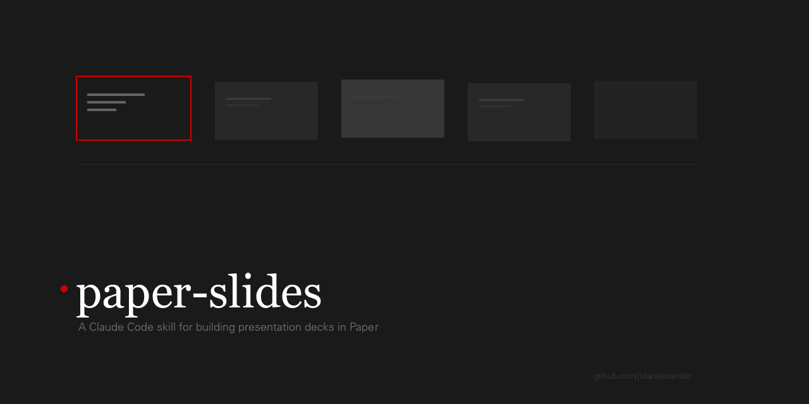

<p align="center">
  
</p>

# paper-slides

A Claude Code skill for building production-quality presentation decks in [Paper](https://paper.design) (the design tool).

Takes content + a design system, produces polished decks on the Paper canvas. Handles content distillation, layout intelligence, visual design, copy quality checks, and pixel-perfect PDF export.

## What it does

- Builds slide decks from any source material (outlines, docs, transcripts, URLs, topics)
- Assigns layouts using a pattern library that matches content shape to visual structure
- Enforces a design system (palette, typography, spacing, structural rules)
- Runs a four-pass quality system after every round of changes
- Exports pixel-perfect PDFs via Paper's MCP screenshot API
- Maintains a feedback log that gets smarter with every session

## Requirements

- [Claude Code](https://docs.anthropic.com/en/docs/claude-code) (CLI)
- [Paper](https://paper.design) desktop app with MCP enabled
- Python 3 with Pillow (`pip install Pillow`) for PDF export

## Installation

Copy the skill files into your Claude Code commands directory:

```bash
# Clone or download this repo
git clone https://github.com/YOUR_USERNAME/paper-slides.git

# Copy into Claude Code commands
cp paper-slides.md ~/.claude/commands/paper-slides.md
cp -r paper-slides/ ~/.claude/commands/paper-slides/
```

Your directory structure should look like:

```
~/.claude/commands/
  paper-slides.md              # Main skill file
  paper-slides/
    feedback-log.md            # Learning log (grows with use)
    references/
      anti-patterns.md         # Common mistakes to avoid
      default-design-system.md # Fallback design system
      design-system-ct-strategy.md  # Example: strategy deck system
      design-system-tms-core.md     # Example: product deck system
      layouts.md               # Layout pattern library
      pdf-export.md            # PDF export pipeline
      quality-system.md        # Four-pass quality scoring
      typography.md            # Typography rules
```

## Usage

### Build a new deck

```
/paper-slides Build a 15-slide strategy deck from this outline: [paste outline]
```

### Enhance an existing deck

```
/paper-slides Improve the existing deck in Paper. Run the quality system and fix issues.
```

### Export to PDF

```
/paper-slides Export the current deck to PDF
```

### Run specific review modes

```
/paper-slides Run Black Hat Strategist on this deck
/paper-slides Run the copy quality pass (stop-slop)
```

## How it works

### Phase 1: Content Structuring
Takes whatever you provide and produces a structured markdown content file. One slide per section, with eyebrow, headline, body, and layout fields.

### Phase 2: Layout Planning
The core intelligence. Reads the full content, understands the narrative arc, and assigns a layout to every slide from the pattern library. Checks for rhythm, variety, density pacing, and section transitions.

### Phase 3: Design Brief
Reads the design system file and extracts palette, typography, spacing, and structural rules.

### Phase 4: Build
Creates artboards in Paper, writes HTML incrementally (one visual group at a time), and screenshots to verify every 2-3 slides.

### Phase 5: Quality System
Four parallel agents score the deck:

1. **Layout Intelligence** -- layout variety, rhythm, content-to-layout fit, density pacing
2. **Design Quality** -- hierarchy, balance, typography, alignment, contrast (scored per slide, 50 max)
3. **Narrative Flow** -- single-mindedness, redundancy, logical arc, earned payoff, specificity
4. **Copy Quality** -- false agency, passive voice, vague declaratives, dramatic fragmentation

Any score below 35/50 triggers automatic fixes.

### Phase 6: Export
Screenshots each artboard at 2x via Paper's MCP API, decodes base64, assembles with Pillow. Pixel-perfect output.

## Design Systems

The skill ships with two example design systems:

- **default-design-system.md** -- Minimal monochromatic system (black/gray/white, single font). Works for any deck type.
- **design-system-ct-strategy.md** -- Example strategy deck system with serif/sans pairing, red accent, specific layout patterns.

Create your own by following the same format. The skill reads the design system file and follows it exactly.

## Feedback Log

The feedback log (`paper-slides/feedback-log.md`) is read at the start of every invocation. It contains binding rules from past sessions. As you use the skill and correct its behavior, those corrections get appended automatically. The skill gets better with every session.

## Layout Pattern Library

The layout library (`references/layouts.md`) defines reusable slide layouts. When you feed in reference decks (PPTX, PDF, Figma), the skill analyzes them for new patterns and adds them to the library. It grows over time.

## License

MIT
