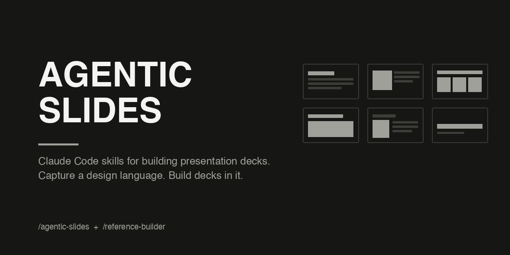

<p align="center">
  
</p>

# Agentic Slides

Two Claude Code skills that work as a pair:

- **`/agentic-slides`** — builds production-quality presentation decks from any source material (outline, doc, transcript, URL). Handles content distillation, layout planning, visual design, copy quality, and export.
- **`/reference-builder`** — points research agents at any brand, deck, product, or design system and produces a structured reference document — including a design-system file that `/agentic-slides` can build decks with.

The combo: **teach it a design language, then build decks in it.**

```
/reference-builder  →  your-design-system.md  →  /agentic-slides  →  finished deck
```

## Requirements

- [Claude Code](https://docs.anthropic.com/en/docs/claude-code) (CLI or desktop app)

**For building decks in Paper (default canvas):**
- [Paper](https://paper.design) desktop app with MCP enabled
- Python 3 with Pillow (`pip install Pillow`) for PDF export

**For building decks in Figma:**
- [Figma MCP server](https://www.figma.com/developers/mcp) configured in Claude Code
- The skill refers to Figma tools as `mcp__<your-figma-server>__use_figma` etc. — the prefix depends on what you named the server; Claude resolves it

**For ingesting PPTX files (optional):**
- `pip install markitdown python-pptx`

`/reference-builder` needs nothing beyond Claude Code itself.

## Setup

```bash
# 1. Unzip (or clone) this folder, then cd into it
cd agentic-slides

# 2. Copy both skills into Claude Code's commands folder
cp agentic-slides.md ~/.claude/commands/
cp -r agentic-slides ~/.claude/commands/
cp reference-builder.md ~/.claude/commands/
```

That's it. Open Claude Code and both `/agentic-slides` and `/reference-builder` are available.

> The folder layout matters: `agentic-slides.md` (the skill) and `agentic-slides/` (its references, agents, and scripts) sit side by side inside `~/.claude/commands/`.

## Usage

### 1. Capture a design language (optional but recommended)

```
/reference-builder Build a design system reference for [brand / deck / product],
focused on the Design System and Brand/Identity lenses.
```

This produces a markdown file with palette hex values, typography, spacing, and layout patterns. Save it anywhere — you'll hand it to the next step.

You can also point `/agentic-slides` directly at a PPTX, PDF, or Figma file and ask it to ingest the design system — it will extract palette, type scale, spacing, and layout patterns into a reusable file.

### 2. Build a deck

```
/agentic-slides Build a 15-slide strategy deck from this outline: [paste outline]
Use the design system at ./my-design-system.md
```

No design system? It falls back to a clean monochromatic default that works for any deck.

Build in Figma instead of Paper:

```
/agentic-slides Build this deck in Figma: [content]
```

### 3. Export

```
/agentic-slides Export the current deck to PDF
```

(Paper only — Figma decks are already in Figma, ready to share.)

## What's under the hood

- **Layout intelligence** — assigns every slide a layout from a pattern library, checking rhythm, variety, and density pacing across the whole deck
- **Four-pass quality system** — parallel agents score layout, design, narrative flow, and copy quality; low scores trigger automatic fixes
- **Per-slide clarity gate** — a "naive reader" agent cold-reads each slide and an expert agent checks every claim against your source material, catching fact drift and confabulated stats before they ship
- **Headline gate** — enforces that every headline expresses the slide's key idea, not just a topic label
- **Self-healing build loop** — screenshots output, evaluates, iterates on mismatches
- **Feedback log** — corrections you make get appended and read at the start of every session; the skill gets better as you use it

## Design systems

Ships with `references/default-design-system.md` — a minimal monochromatic system that works for any deck. Create your own with `/reference-builder` or the built-in ingestion mode, and the skill will follow it exactly.

## License

MIT
